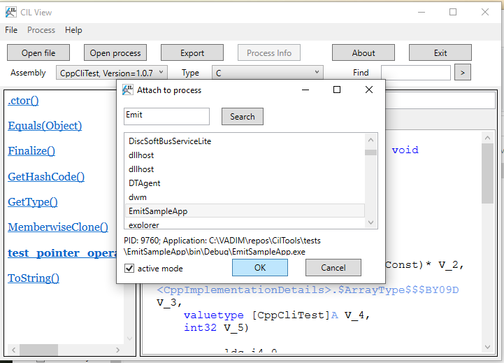

# CilView user manual

**Requirements:** .NET Framework 4.5+  
**License:** BSD 3-Clause  
**Repository:** https://github.com/MSDN-WhiteKnight/CilTools  

CilView is a windows application to display CIL code of methods in .NET assemblies. The key features are:

- Displaying CIL code of methods in the specified assembly file or process
- Syntax highlighting
- Navigation to the referenced method's code by clicking on the method reference
- Exporting the method's code into file
- Displaying process information and stack traces of managed threads (when process is opened)

## Displaying code from the assembly file

1\. Click **File** -> **Open** menu or press the **Open file** button. 

2\. Select the managed assembly EXE or DLL file in the file open dialog. 

3\. Select type from the **Type** drop-down list in the main window 

You can also search type by entering the fragment of the type name to **Find** text field and pressing the "**>**" button. The search will select the matching type if it's found. Press the button again to go to the next matching type. The program will display message if when the end of list is reached.

4\. Select method in the left panel.

5\. The right panel will display the CIL disassembly of the selected method.

All method references on the **Formatted** tab are hyperlinks to the referenced methods. Clicking one them will open the referenced method's code in the right panel, even if the method is from another assembly, as long as that assembly could be loaded. 

## Displaying code from the process

1\. Click **File** -> **Open process** menu or press the **Open process** button. 

2\. Select the process from the list in the appearing **Attach to process** dialog.

You can search process by entering the process name starting fragment or ID into the text field and pressing **Search**.

3\. Check the **active mode** checkbox if you want to get more accurate info.

> **NOTE:** When attaching in active mode, the target process is suspended. Do not use active mode on the application that is currently performing critical business tasks.

4\. Press **OK**. The CIL View will scan the target process for loaded assemblies and open them.

5\. Select assembly from the **Assembly** drop-down list in the main window 

6\. Select type from the **Type** drop-down list in the main window

7\. Select method in the left panel.

You can also search assemblies, types and methods by entering the fragment of their names into the **Find** text field and pressing the "**>**" button. CIL View searches methods in the currently selected type, if the type is selected. In a similar way, types are searched in the currently selected assembly, if one is selected. The search results are shown in the context menu. Clicking on the menu item navigates to the corresponding object.

8\. The right panel will display the CIL disassembly of the selected method.

You can also view the code of dynamic methods generated at runtime in the target process by selecting the `<...DynamicMethods>` entry in the assembly drop-down list (it is displayed at the end of the list). Starting from version 2.2, methods from dynamic assemblies are not included under dynamic methods and instead can be opened under the corresponding dynamic assembly.

## Limitations when displaying code from the process

If the assembly is a dynamic assembly or an assembly that could not be loaded by CIL View as file (this is usually happens with some mixed-mode assemblies which have some PE structures stripped off, so they could be loaded by CLR, but not by System.Reflection.Metadata), the following limitations apply:

- Method return value or parameter types are not shown 
- String literal tokens are not resolved
- Standalone signature tokens are not resolved
- Tokens of external assembly members are not resolved
- Local variables are not shown 
- Exception handling blocks are not shown (except for methods from dynamic assemblies)

For dynamic methods, the following limitations apply:

- Method signatures are not shown 
- All tokens, except for method tokens, are not resolved
- Local variables are not shown

When opening the 64-bit process, the following limitations apply:

- Dynamic assemblies and dynamic methods are not shown
- Assemblies that could not be loaded by CIL View as files (see above) are not shown
- Process and threads information is not available

> **NOTE:** .NET Core shared host is 64-bit on 64-bit Windows, but if you want to overcome these limitations, you can build it targeting the win-x86 runtime ID and start it from the resulting EXE file rather than using shared host.

## Examining managed threads

To examine managed threads when process is opened, click **Process** -> **Threads** menu. The Threads window displays a drop-down list of managed threads. Each list item contains native thread ID, thread type for special threads (GC, Finalizer, Thread pool), COM apartment type (STA or MTA), and the topmost stack frame info. Select thread from the list to view the full stack trace.

The stack trace will be displayed in the left panel. Some stack frames are hyperlinks, and clicking on them will open the corresponding method in the right panel. The instructions belonging to the approximate currently executed code fragment are highlighted in red. This feature only works reliably when attaching in active mode. 

## Exception analysis

To figure out exceptions that the method could potentially throw, open that method and use **Analysis** -> **Show exception (methods)** menu command. In the opened window you'll see the list of exception types as well as the call stack that could trigger them. The CIL View recursively scans the analysed method and all methods called by it, and searches for exceptions that are thrown and not handled up the stack. Not that exception analysis might be inaccurate (bot false positives and false negatives, so it's only good for a quick estimate of thrown exceptions. To perform exception analysis on all methods of the current type, use **Analysis** -> **Show exception (type)**.

To compare exceptions actually thrown by methods of the type and exceptions mentioned in their documentation, select the type and use **Analysis** -> **Compare exceptions** command. In the appearing dialog box, select the XML documentation file to compare. CIL View supports both regular ECMA XML emitted by C# compiler and monodoc XML format. The opened window will show the differences between exceptions reported by analysis and exceptions documented in ECMA XML `<exception>` tags.

The exception analysis supported when opening both files and processes. However, when you hit any limitations mentioned above, the analysis accuracy decreases.

## ClickOnce installation with auto-update

You can install CIL View via ClickOnce if you want to download updates automatically. The ClickOnce download URL: https://msdn-whiteknight.github.io/CilTools/update/

Using auto-update requires stable internet connection and access to the https://msdn-whiteknight.github.io/ website. If you are using old Windows or .NET Framework versions, you might be unable to connect due to TLS protocol version or ciphersuite mismatch.

## Changelog

2.1

- Update assembly reading mechanism to use CilTools.Metadata instead of loading assemblies directly into the current process. This enables inspecting assemblies for another target framework (such as .NET Standard) or when some dependencies could not be resolved. This also means assemblies can be unloaded from memory when they are no longer needed.
- Add support for method implementation flags when outputting method signatures
- Add support for function pointer types
- Add support for module-level ("global") functions and fields
- Add syntax highlighting for calli instruction's operand
- Add full custom modifiers support (they were previously only supported in standalone signatures)
- Add custom modifier syntax highlighting
- Add pinvokeimpl support
- Add exception block support for dynamic methods
- Add method token resolution for dynamic methods
- Support auto-completion in assembly and type combo boxes
- Improve performance for type combo box when assembly has a lot of types
- Rework search. Search results are now displayed in context menu. Method search is added.
- Format char default values as hex
- Improve custom attribute support (now custom attribute data is properly shown for any attribute)
- Improve empty method body handling. Now empty body is ignored only when method is is abstract, P/Invoke or implemented by runtime. In other cases the error message is displayed.
- Place custom attributes before default parameter values in disassembled method code
- Fix ldloc.s/stloc.s instruction handling
- Fix ldtoken instruction handling with field operand
- Fix exception when method implementation is provided by runtime
- Fix possible null reference exception when reading array/pointer of generic args
- Fix BadImageFormatException on C++/CLI assemblies
- Fix signatures with function pointers being incorrectly displayed in left panel

2.2

- Add support for `constrained.` instruction prefix
- Add type definition disassembler
- Add **Open BCL assembly** dialog
- Add navigation history
- Add partial support for 64-bit processes
- Add support for dynamic assemblies
- Add exception analysis
- Disable wrapping in search textbox
- Method navigation hyperlink now spans only over the method name identifier, instead of the whole method reference syntax
- Method navigation hyperlink is no longer underlined (to fix cases where it was obscuring _ chars in name)
- Improve performance of "Open process" by preloading assemblies from files instead of reading target process memory, where it's possible
- Fix null reference on typedref parameter
- Fix unhandled exception when opening file on background thread
- Fix token resolution bug after navigating to generic method instantiation
- Fix crashes on access to disposed assemblies

2.3

- Escape IL assembler keywords when used as identifiers
- Make search in **Open process** window case-insensitive
- Add support for displaying dynamic assembly names when inspecting process (.NET Framework only)
- Show loaded modules in process info

---------------------------------------------

*Copyright (c) 2021,  MSDN.WhiteKnight*

*This CIL View distribution contains the binary code of [ClrMD](https://github.com/microsoft/clrmd) library: Copyright (c) .NET Foundation and Contributors, MIT License.*
